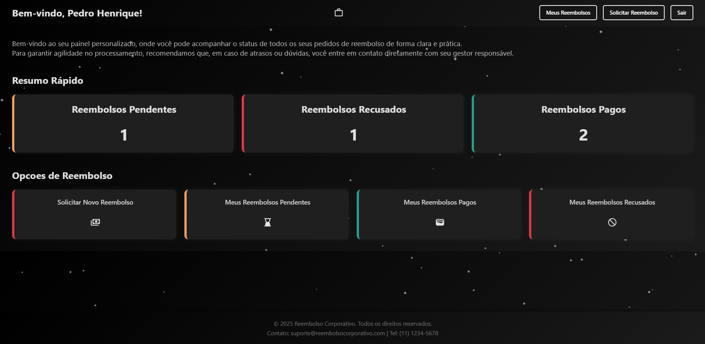
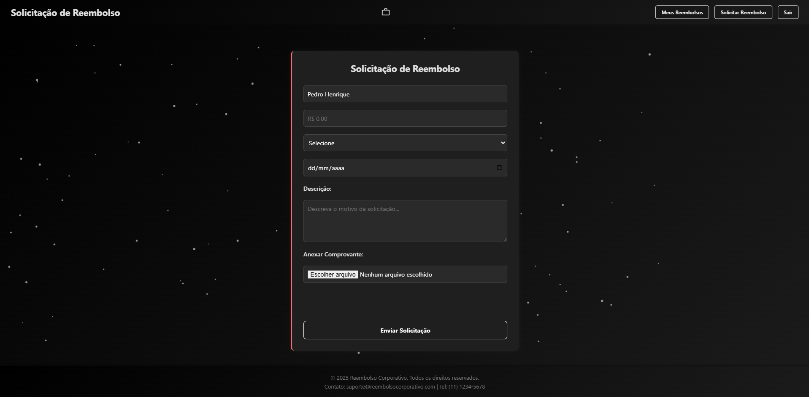
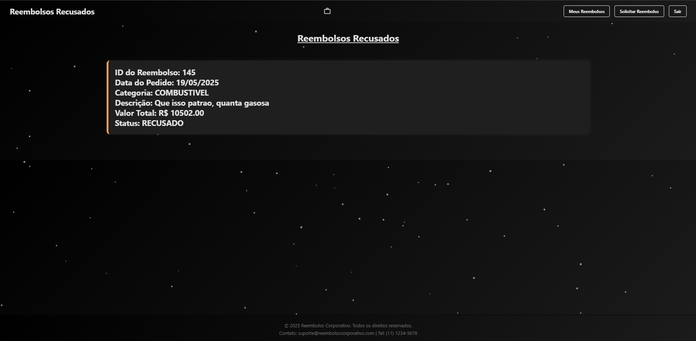
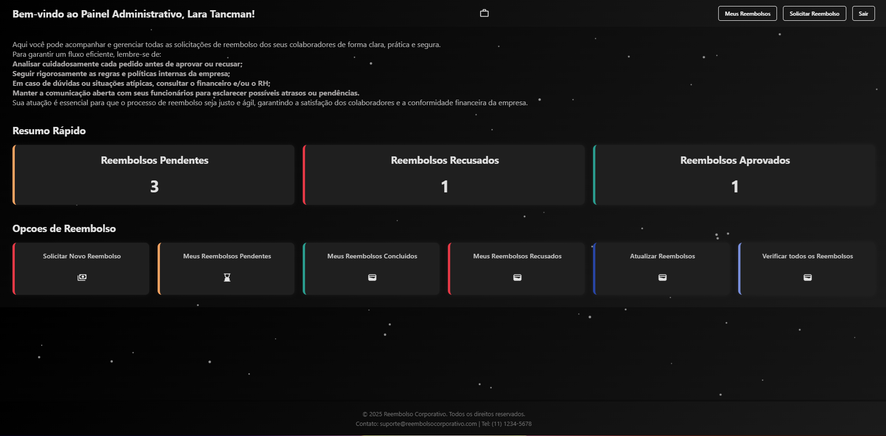
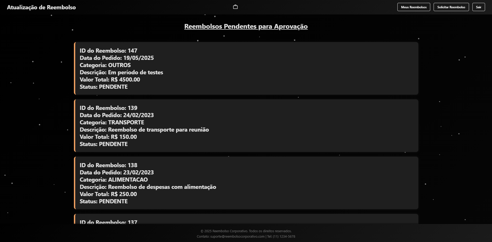
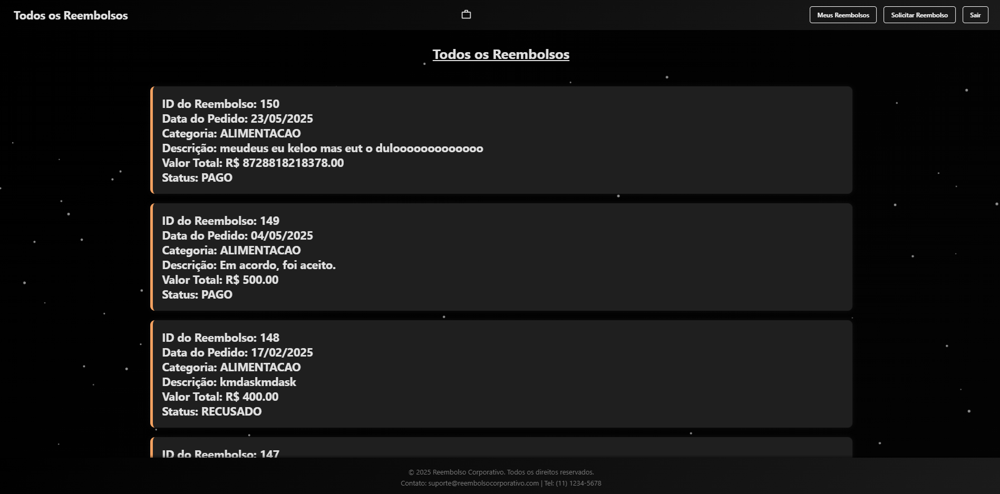

# Controle de Reembolso Corporativo

---

## Descrição

Sistema backend desenvolvido em Java com Spring Boot para gerenciamento de autenticação de usuários e controle de solicitações de reembolso corporativo.  
Permite o cadastro e login de usuários, solicitação, consulta e atualização do status dos reembolsos, além de gerenciamento dos documentos anexos (comprovantes).

---

## Funcionalidades

### Autenticação

- Registro de usuário com validações.
- Login autenticando usuário por email e senha.
- Geração de token JWT para sessões autenticadas.

### Reembolso

- Solicitação de reembolso com upload de comprovante.
- Consulta de reembolsos pendentes, concluídos, recusados e por status.
- Atualização do status de solicitações de reembolso.
- Verificação de usuários solicitantes e responsáveis.
- Listagem de reembolsos para atualização.

---

## Tecnologias utilizadas

- Java 17+
- Spring Boot
- Spring Security
- JWT para autenticação
- Swagger/OpenAPI para documentação da API
- Jakarta Validation para validação de dados
- MultipartFile para upload de comprovantes

---

## Endpoints Principais

### Autenticação (`/api/auth`)

| Método | Endpoint              | Descrição                              |
|--------|-----------------------|--------------------------------------|
| POST   | `/login/usuario`      | Login de usuário e geração de token JWT |
| POST   | `/registrar/usuario`  | Registro de novo usuário              |

### Reembolso (`/reembolso`)

| Método | Endpoint                   | Descrição                                |
|--------|----------------------------|------------------------------------------|
| POST   | `/solicitar`               | Solicitação de reembolso com comprovante |
| POST   | `/meusReembolsos`          | Consulta reembolsos pendentes do usuário  |
| POST   | `/todosAbertos`            | Consulta todos reembolsos pendentes       |
| PUT    | `/alterarStatusReembolso`  | Atualiza status de um reembolso           |
| POST   | `/consultarPorStatus`      | Consulta reembolsos por status            |
| POST   | `/reembolsosConcluidos`    | Consulta reembolsos concluídos            |
| POST   | `/ReembolsoAtualizar`      | Lista reembolsos pendentes para atualizar |
| POST   | `/verificarSolicitante`    | Verifica existência de usuário solicitante |
| POST   | `/reembolsosPendentes`     | Consulta reembolsos pendentes (detalhado) |
| POST   | `/reembolsosRecusados`     | Consulta reembolsos recusados             |

---

## Estrutura das DTOs principais

- **LoginUsuarioDTO**: Dados para login (nome/email e senha)
- **RegistroUsuarioDTO**: Dados para registro de usuário
- **SolicitarReembolsoDTO**: Dados para solicitação de reembolso
- **ResponsavelReembolsoDTO**: Dados para consultas por usuário
- **AtualizarStatusReembolsoDTO**: Dados para atualizar status de reembolso

---

## Erros e exceções

- Retorna mensagens claras para erros de autenticação e falhas em cadastro/solicitação.
- Exceções específicas para controle de erros de negócio, como `CadastroException` e `ReembolsoException`.

---

## Demonstração

### Tela de Login

### Tela Inicial ( Funcionario )

### Solicitar Reembolso

### Listagem reembolsos pendentes

### Listagem reembolsos pagos

### Listagem reembolsos recusados

### Tela Inicial ( Gestor / Financeiro )

### Listagem pendentes para atualizacao

### Listagem todos os Reembolsos

---

### Fluxo Completo (GIF)

---
## Contato

Para dúvidas, sugestões ou contribuições, abra uma issue ou envie um e-mail para:

**Henrique**  
📧 henrique@exemplo.com  
🔗 [LinkedIn](https://www.linkedin.com/in/henrique)
